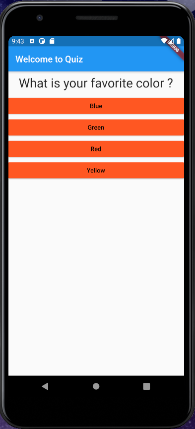
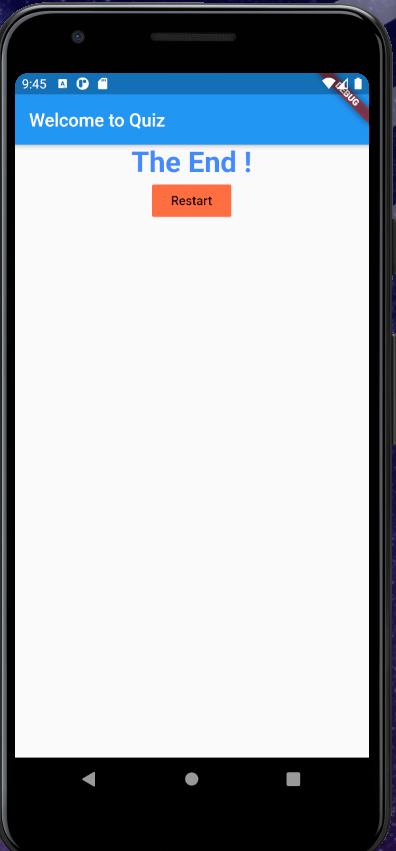

# quiz_app_activity

My first Flutter project used to practice Dart syntax as well as putting various aspects of development together. 

# Description 

This is a simple questionnaire application. A user receives a simple display of multiple choice questions
Questions can be selected one by one until they are all done
At the end the user is presented with the option to reset the questionnaire from the start

# To-do
[x] Create the basic data structure for the questionnaire
[x] Make sure you can display the question based on the index of the question
[x] Loop through the List of options and display them dynamically
[x] Create the answer question function
[x] Create the ending condition and display the end page
[x] Create a separate quiz.dart file such that you can clean up the main file

# Sample Images

## Getting Started

This project is a starting point for a Flutter application.

A few resources to get you started if this is your first Flutter project:

- [Lab: Write your first Flutter app](https://flutter.dev/docs/get-started/codelab)
- [Cookbook: Useful Flutter samples](https://flutter.dev/docs/cookbook)

For help getting started with Flutter, view our
[online documentation](https://flutter.dev/docs), which offers tutorials,
samples, guidance on mobile development, and a full API reference.
